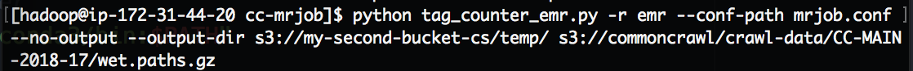
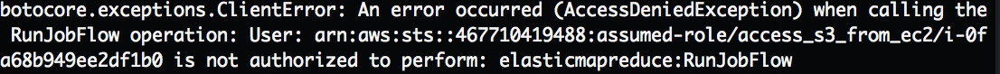

## Exploring Common Crawl Data with Spark & AWS

Richard Haussman, Chris Stafford, Tyson Ward

*Using Spark and AWS to uncover basic statistics from Common Crawl.*

#### Goals

* Practice Spark
* Practice AWS, including AMAZON EMR, S3, and boto3
* Work with a sub-sample of big data locally first BEFORE training on the full dataset (or a larger subset of the data) on S3.
* Practice scoping a potentially extremely time-intensive project so that you have reliable results in just one day.

#### About Common Crawl

The Common Crawl is a non-profit organization that uses web crawlers to index the world wide web. Besides providing useful search results, data obtained from web crawling has been used to "improve language translation software, predict trends, track disease propagation and more."

#### The Data

* Files types : .warc, .wet, .wat . . .what?: Data are stored in .warc files, which are a combination of .wet and .wat files.  .wat files contained meta data about each website, and .wet files contain the *extracted text* from each webpage.

#### Questions

What servers served the most pages?
What words are most common, and how do they change month to month?

#### Approach

1. After settling on Common Crawl, we began looking at the cc-pyspark directory
2. Tyson and Hauss began following a blog that showed how to work with the data
3. Chris began using the word_count.py file to explore ways toward td-idf
4. We hoped to continue until convergence, but . . .

#### Starting Local

Locally, were extracted counts of pages served by several servers using the server_count.py script and the TF and DF using word_count.py.

**Server Counts**

|   Server    |   Pages Served       |
|:-----------:|:------------------------------------:|
|'Apache' | 9084 |
'nginx' | 7543
'cloudflare-nginx' | 3538
'(no server in HTTP header)' | 3490
'GSE' | 2562
'Microsoft-IIS/7.5' | 1802
'Microsoft-IIS/8.5' | 1412
'nginx/1.10.2' | 651
'nginx/1.10.3' | 646
'Apache/2.2.15 (CentOS)' | 620

**Term/Document Frequencies**

#### Running on the Cloud

Run python script and pipe results to bucket

**Permission Errors!**

### More Cloud Errors

Initial issues slowed down the start (failed keys, etc.).

We were able to load week 2017-4 of Common Crawl data from s3 onto the server for processing.

Using spark-submit ran the script.

***ISSUE:*** Pyspark command line started but failed in the Python script.
***TRIED:*** Installing Anaconda
***SOLVED:*** Script required specific modules called out to work.

***ISSUE:*** Python script ran but not results were returned to the parquet db
***CHECKED:*** ps aux|head -10 or top to see processes
***ATTEMPTED:*** Spark web interface (ssh to port 8157 hung + Firefox proxy instructions were out of date)
***ATTEMPTED:*** No tables were returned in spark-sql 

#### References
* [Common Crawl](http://commoncrawl.org/)
* [*Analyzing Petabytes of Websites*](http://tech.marksblogg.com/petabytes-of-website-data-spark-emr.html) - Mark Litwintschik
